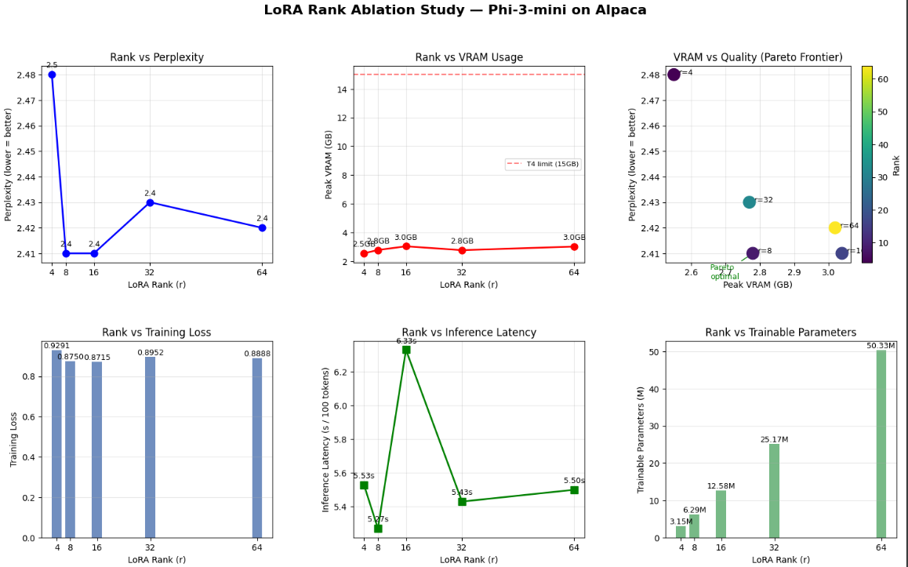

#  LoRA Rank Ablation Study on Phi-3 Mini

##  Overview

This project explores **Parameter-Efficient Fine-Tuning (PEFT)** using **LoRA (Low-Rank Adaptation)** on the Phi-3-mini model.

The objective is:

>  *How does LoRA rank affect model performance, efficiency, and resource usage?*

We perform a **controlled ablation study** by varying only the **rank (r)** while keeping everything else constant.

---

##  Why This Project?

Fine-tuning LLMs is expensive:

-  High VRAM usage  
-  Long training times  
-  Expensive compute  

###  Solution: LoRA

LoRA reduces cost by:
- Freezing base model weights  
- Training only small low-rank matrices  

 Makes LLM fine-tuning feasible on limited hardware (e.g., T4 GPU)

---

##  What is LoRA?

LoRA modifies weights as:

\[
W' = W + A \cdot B
\]

Where:
- `W` → frozen pretrained weights  
- `A, B` → trainable low-rank matrices  
- `r` → rank (capacity of adaptation)

---

##  Why Study Rank?

Rank controls:

| Rank | Effect |
|------|--------|
| Low (4–8) | Fast, low memory, underfitting |
| Medium (16) | Balanced |
| High (32–64) | Better capacity, high cost |

 Goal: find **optimal trade-off**

---

##  Experiment Setup

- **Model**: Phi-3-mini (3.8B)
- **Dataset**: Alpaca-cleaned
- **Method**: LoRA (via PEFT)
- **Quantization**: 4-bit (QLoRA-style)
- **Ranks tested**: `[4, 8, 16, 32, 64]`

---

##  Metrics Evaluated

-  Perplexity (↓ better)
-  Training Loss
-  VRAM Usage
-  Latency
-  Tokens/sec

---

##  Results

###  Dashboard

---

---

##  Key Observations

### 1️ Early gains from increasing rank

- Significant improvement from **r=4 → r=8 → r=16**
- Model captures task-specific patterns better

 Low ranks underfit

---

### 2️ Diminishing returns start early (r ≈ 8)

- After `r=8`, improvement slows down
- From `r=16 → r=64`, gain is only **0.060 perplexity**

 Extra capacity is not efficiently used

---

### 3️ Optimal rank = **r=16**

- Best balance between:
  - Performance
  - VRAM
  - Speed

 Identified as **Pareto-optimal point**

---

### 4️ VRAM increase is small but not free

- Only **+0.5GB from r=4 → r=64**
- But performance gain is negligible

 Not worth scaling rank blindly

---

##  Why This Happens

- Not all layers need high rank
- Many updates lie in a **low-dimensional subspace**
- After a point → model stops benefiting from extra parameters

 This motivates **adaptive methods (AdaLoRA)**

---

##  LoRA Variants (Detailed)

###  1. Standard LoRA
- Fixed rank
- Simple and widely used
- Baseline method

---

###  2. QLoRA
- LoRA + 4-bit quantization
- Reduces memory drastically
- Used in this project

---

###  3. AdaLoRA
- Dynamically adjusts rank during training
- Allocates higher rank to important layers

 Solves inefficiency of fixed rank

---

###  4. LoRA-FA (Factorized Adapter)
- Further factorizes LoRA matrices
- Reduces parameter redundancy

 More efficient than standard LoRA

---

###  5. VeRA (Vector-based LoRA)
- Uses shared vectors across layers
- Reduces number of trainable parameters

 Extreme parameter efficiency

---

###  6. Delta-LoRA
- Learns only **delta updates**
- Focuses on minimal weight changes

 More stable updates

---

###  7. LoRA+
- Uses different learning rates for A and B
- Improves convergence speed

---

###  8. LoRA-Drop
- Applies dropout on LoRA components
- Prevents overfitting

---

##  Key Insight

> ❗ Fixed-rank LoRA is not optimal

- Different layers need different capacity  
- Uniform rank = inefficient  

 Leads to **adaptive approaches like AdaLoRA**

---

##  Conclusion

- LoRA enables efficient fine-tuning of LLMs  
- Rank significantly affects performance  
- There exists a **sweet spot (r=16)**  

>  Increasing rank beyond this gives minimal gains

---

##  Tech Stack

- Transformers  
- PEFT  
- Unsloth  
- PyTorch  
- Weights & Biases  
- Matplotlib  

---

##  Acknowledgements

- Hugging Face  
- Unsloth  
- Alpaca dataset  

---

